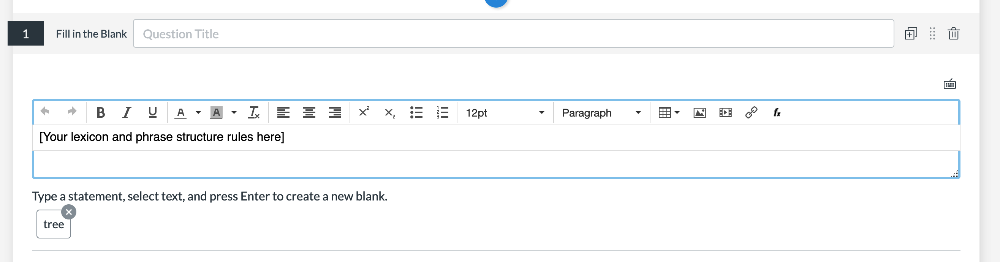
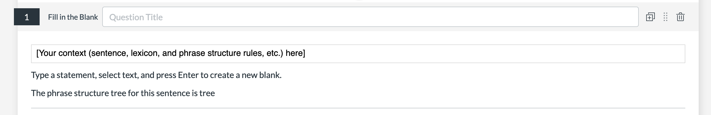
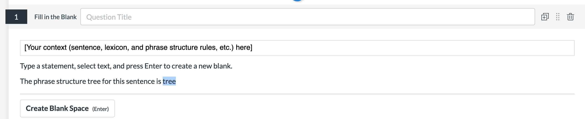
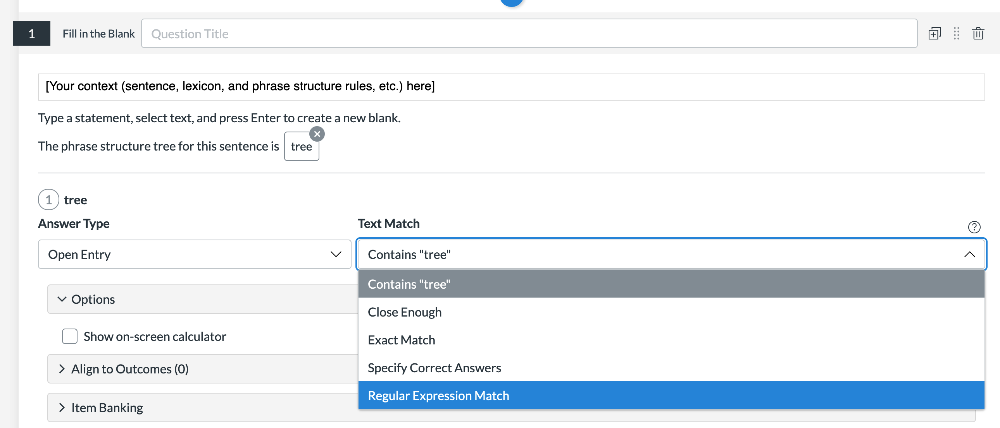
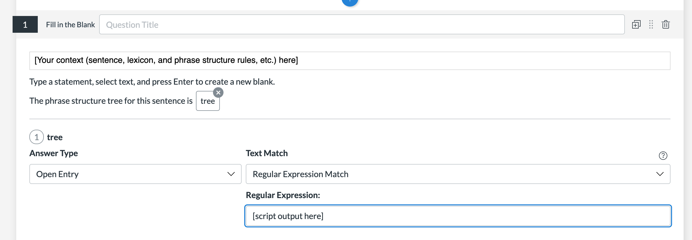

# Instructions for creating auto-graded phrase structure tree questions

1. On Canvas create a quiz.
    - If you are prompted to choose between "classic" and "new" quiz, choose "new".
2. Create a question and choose "Fill in the blank" as the question type.
3. Add your context to the first text box.
    - 
4. Type your prompt (e.g. "The phrase structure grammar for this sentence is tree") in the second text box.
    - 
5. Highlight a word at the end of the prompt (e.g. "tree") and click "create blank space".
    - 
6. Change the Answer Type to "Open Entry" and Text Match to "Regular Expression Match".
    - 
7. Go to [RSyntaxTree](https://yohasebe.com/rsyntaxtree/) and create a tree with the correct answer.
8. Copy the code for the correct tree and paste it into a `.txt` file on your computer.
9. Download `answer_to_regex.py` from this repository to your computer.
10. In a terminal run `python3 path/to/answer_to_regex.py path/to/answer_txt_file.txt` (using the paths on your computer).
11. Copy the output of the script into the "Regular Expression" field in the Canvas quiz editor.
    - 
12. Done!😄
